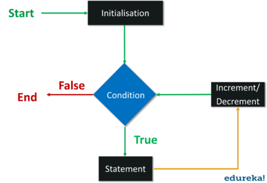
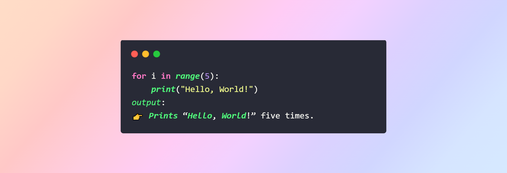
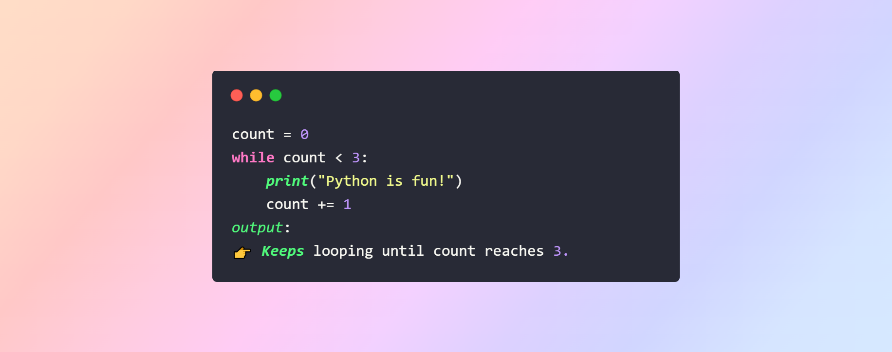
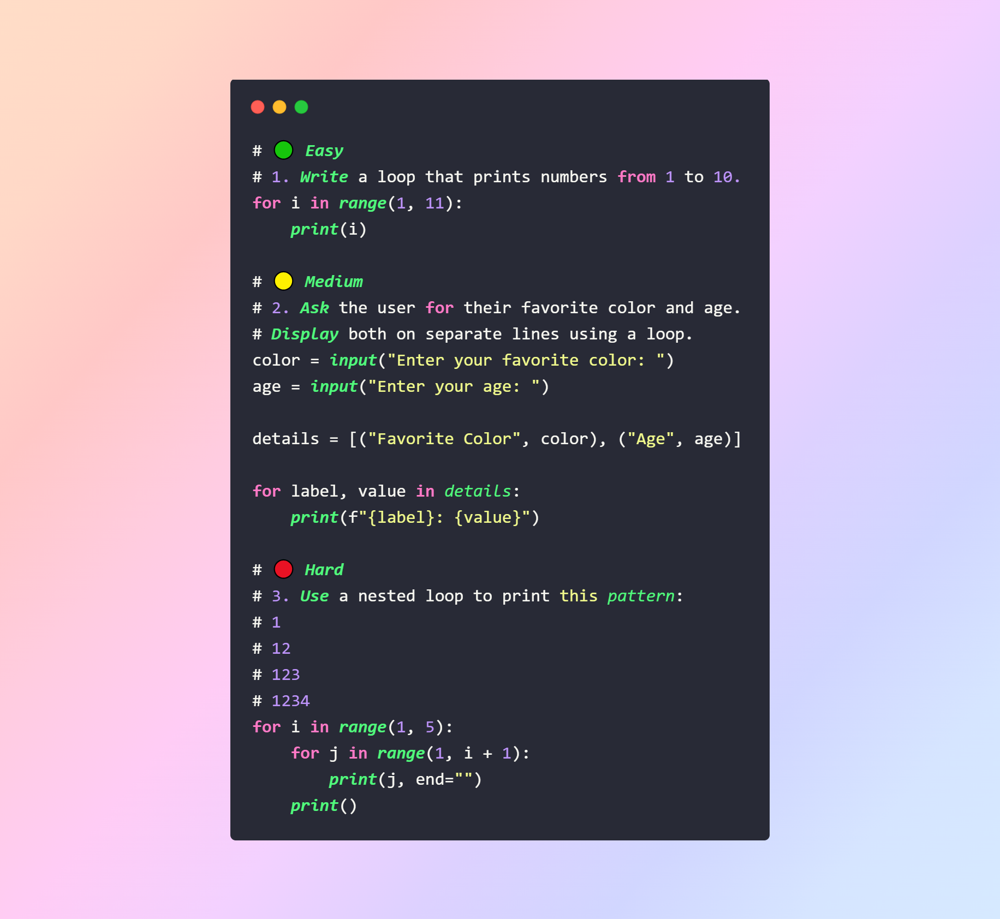
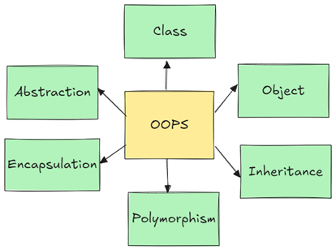
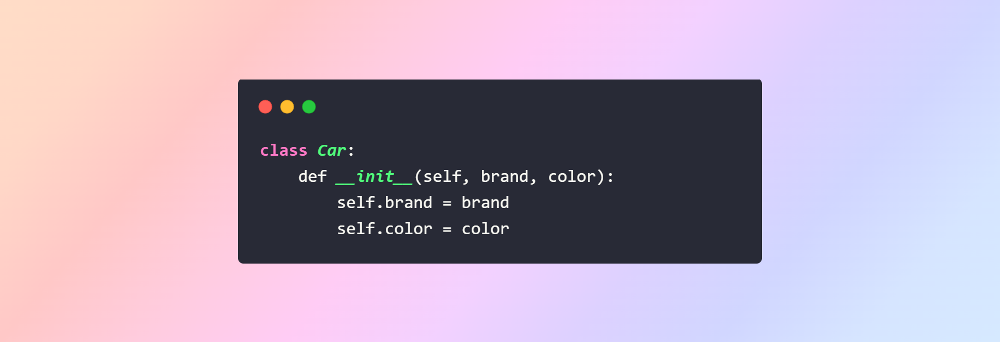
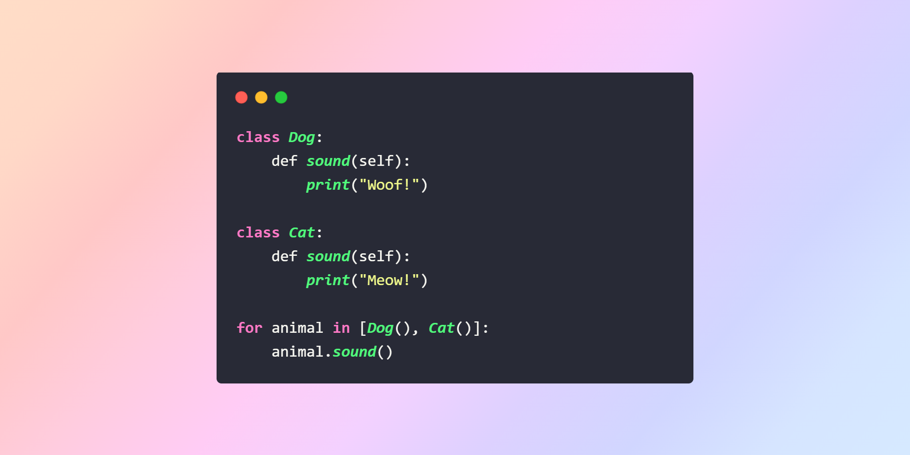
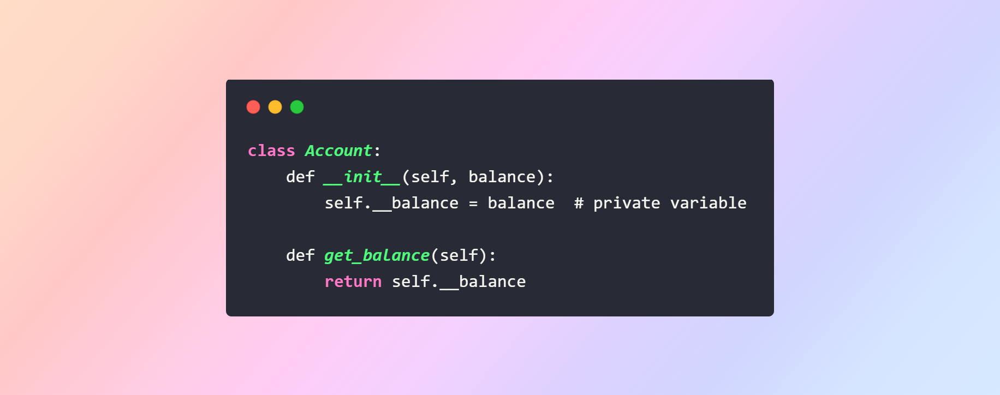
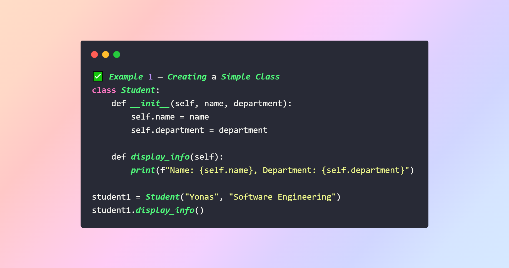

# Loops & Object-Oriented Programming (OOP)
### 📑 Table of Contents
#### 📘 [Introduction](#introduction)

#### 🌀 [Loops in Python](#loops-in-python)
- [What Are Loops](#what-are-loops)
- [Types of Loops](#types-of-loops)
- [Visuals & Examples](#visuals--examples)
- [Practice Questions Easy Medium Hard](#practice-questions-easy-medium-hard)

#### 🧱 [Object-Oriented Programming OOP](#object-oriented-programming-oop)
- [What Is OOP](#what-is-oop)
- [Core Concepts of OOP](#core-concepts-of-oop)
- [Code Demonstrations](#code-demonstrations)
- [Practice Questions Easy Medium Hard](#oop-practice-questions-easy-medium-hard)

#### 🎯 [Conclusion & Quick Recap](#conclusion--quick-recap)

--- 

### 📘 Introduction
1. Loops — used for repeating tasks efficiently.

2. Object-Oriented Programming (OOP) — a structured way to build scalable and reusable software.

---

### 🌀 Loops in Python
🔁 What Are Loops?

A loop allows you to execute a block of code repeatedly until a specific condition is met.
Python supports mainly two types of loops:

#### for loop 
→ iterate over a sequence (like list, tuple, string)

#### while loop 
→ repeat until a condition becomes False

### 🧮 Types of Loops

#### 1. For Loop

#### 2. While Loop

#### 3. Nested Loop

### 🧠 Visuals & Examples

   ↓ Start
[Condition Check]
     ↓ Yes
 [Execute Code]
     ↓
 [Update/Increment]
     ↑
     └── No → End

---

### 💡 Practice Questions (Easy, Medium, Hard)
#### 🟢 Easy
1. Write a loop that prints numbers from 1 to 10.
#### 🟡 Medium
2. Ask the user for their favorite color and age.
Display both on separate lines using a loop.
#### 🔴 Hard
Use a nested loop to print this 
1
12
123
1234

#### Answer of the questions

---

#### 🧱 Object-Oriented Programming (OOP)

##### 💭 What Is OOP?

- OOP is a way of structuring programs so that properties and behaviors are bundled into individual objects.
- Each object represents a real-world entity like a car, student, or bank account.

### 🧩 Core Concepts of OOP
#### 1. Class
A class is a blueprint for creating objects.

#### 2. Object
An object is an instance of a class.

#### 3. Inheritance
Allows a class to use properties/methods from another class.

#### 4. Polymorphism
Different classes can use the same method name with different behavior.

#### 5. Encapsulation
Protecting internal data using private variables.

| Concept       | Real-Life Example                                  |
| ------------- | -------------------------------------------------- |
| Class         | Blueprint of a house                               |
| Object        | A specific house built from the blueprint         |
| Inheritance   | Child inheriting traits from parents              |
| Encapsulation | ATM hiding your PIN                                |
| Polymorphism  | Different vehicles having their own “start” method|

### 🧪 Code Demonstrations

--- 
### 💡 OOP Practice Questions (Easy, Medium, Hard)
#### 🟢 Easy
Create a class Person with attributes name and age. Print both values.

#### 🟡 Medium
Write a class Rectangle that has methods to calculate area and perimeter.
##### Hint:
area = length * width
perimeter = 2 * (length + width)

##### 🔴 Hard
Create a parent class Vehicle and a child class Car that inherits from it.
The Car should have an extra attribute fuel_type and a method to display all details.

#### Answer of the questions

####  🎯 Conclusion & Quick Recap

Loops help in repeating actions efficiently.

OOP allows you to create structured, reusable, and organized code.

You learned about:

For, While, and Nested Loops

Classes, Objects, Inheritance, Polymorphism, and Encapsulation

🚀 Practice and experiment with your own examples to master these concepts!