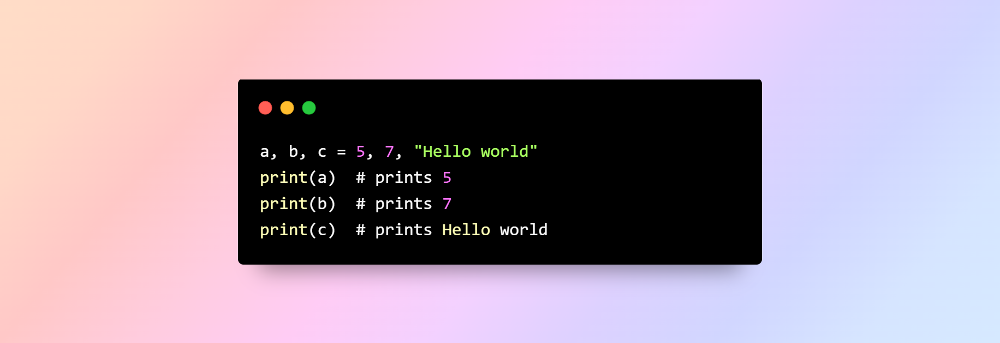
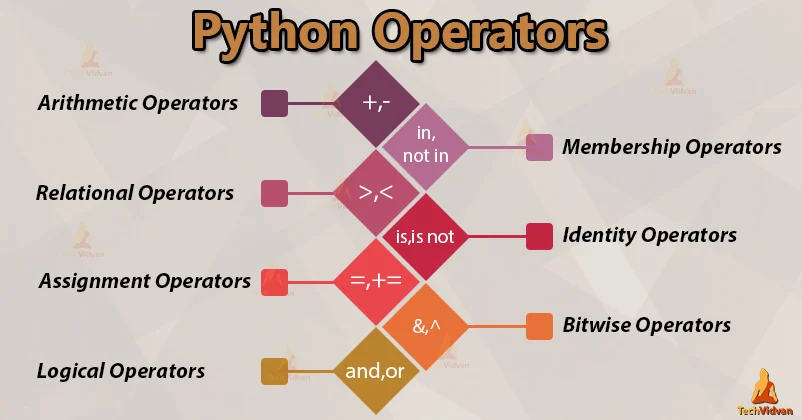
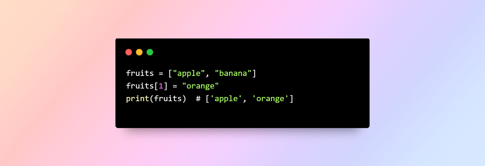
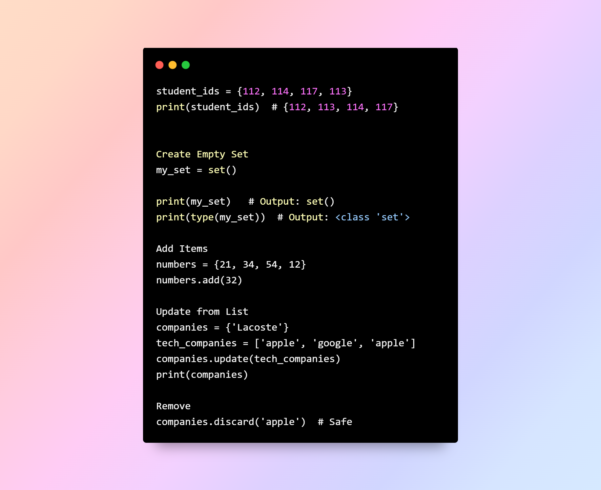

**Complete Teaching Guide with Progressive Exercises**  
---

## Table of Contents
1. [Installing Python](#installing-python)  
2. [Variables](#variables)  
3. [Data Types](#data-types)  
   → **[Exercise Set 1 (Easy, Medium, Hard)](#exercise-set-1)**  

4. [Operators](#operators)  
5. [Mutability and Immutability](#mutability-immutability)  
6. [Dictionaries](#dictionaries)  
   → **[Exercise Set 2 (Easy, Medium, Hard)](#exercise-set-2)**  

7. [Sets](#sets)  
8. [Strings](#strings)  
9. [Conditional Statements](#conditional-statements)  
   → **[Exercise Set 3 (Easy, Medium, Hard)](#exercise-set-3)**
---

## 1. Installing Python

Python is free and easy to install on all major operating systems (Windows, macOS, and Linux). Follow these steps to install it properly.

#### On Windows
1. Go to the official [Python website](https://www.python.org/downloads/).
2. Click **Download Python (latest version)**.
3. Run the downloaded installer.
4. Wait for the installation to complete, then open **Command Prompt** and type: 
### bash
python --version 

---
## 2. Variables
What is a Variable?

In programming, a variable is a container (storage area) to hold data.

##### Assigning Multiple Values to Multiple Variables

##### Rules for Naming Python Variables (63)
Constant and variable names should have a combination of:
- Letters in lowercase (a to z)
- Letters in uppercase (A to Z)
- Digits (0 to 9)
- Underscores (_)
#### Allowed 
Can use lowercase letters, uppercase letters, digits (0–9), and underscores _.
Must not start with a digit.
Cannot be a Python keyword (like if, for, while, etc.)
- age = 25
- name = "biniyam"
- student_age = 20
- TotalMarks = 100
- pi_value = 3.1415
- number1 = 10
#### Not Allowed 
tarts with a digit.
Contains special characters like @, #, !, -, space.=
Is a reserved Python keyword.
- 1st_number = 10      
- total-marks = 100    
- my name = "Yonas"    
- for = 5              
- @value = 10        
#### Python is case-sensitive, so num and Num are different variables.  

Warning: Avoid using Python keywords like if, True, class, etc., as variable names.

#### Taking input from user
- input() always returns a string
- The text inside () is shown to the user
- Press Enter to submit

### 3. Data Types
In computer programming, data types specify the type of data that can be stored inside a variable.

| Data Type Class | Description |
|-----------------|-------------|
| Numeric         | int, float, complex – Holds numeric values |
| String          | str – Holds sequence of characters |
| Sequence        | list, tuple, range – Holds collection of items |
| Mapping         | dict – Holds data in key-value pair form |
| Boolean         | bool – Holds either True or False |
| Set             | set – Holds collection of unique items |

#### We can use the type() function:
 num1 = 55
 num2 = 5.3
 print(num1)  
 print(num2) 
- print(type(num1))   <class 'int'>
- print(type(num2))  <class 'float'>
- print(type(num2))  <class 'float'>

--- 
## Exercise Set 1: Variables & Data Types

### Easy  
Create three variables: one integer, one float, and one string. Print each variable and its data type using `type()`.

---

### Medium 
- Ask the user for their favorite color.
- Ask the user for their age.
#### Example Output:
    -Your favorite color is [color] 
    -Your  age is [age] years old!

### Hard
1. Create **five variables** of different data types: integer, float, string, list, and dictionary.  
2. Print each variable, its type, and for sequence/mapping types, also print the **length**.

---
## Exercise Set 1: Variables & Data Types – Answers

---
## 4. Operators
*Operators are special symbols that perform operations on variables and values.*

#### A. Python Arithmetic Operators
| Operator | Operation         | Example      |
|----------|-----------------|-------------|
| +        | addition          | 5 + 2 = 7   |
| -        | subtraction       | 4 - 2 = 2   |
| *        | multiplication    | 2 * 3 = 6   |
| **       | exponentiation    | 4 ** 2 = 16 |
| /        | float division    | 4 / 2 = 2.0 |
| //       | floor division    | 10 // 3 = 3 |
| %        | modulus           | 5 % 2 = 1   |

### B. Python Assignment Operators
| Operator | Description                        | Example        |
|----------|------------------------------------|----------------|
| =        | Assign value to a variable         | x = 5          |
| +=       | Add and assign                     | x += 3   ->  x = x + 3 |
| -=       | Subtract and assign                | x -= 2   ->  x = x - 2 |
| *=       | Multiply and assign                | x *= 4   ->  x = x * 4 |
| /=       | Divide and assign (float division) | x /= 2   ->  x = x / 2 |
| %=       | Modulus and assign                 | x %= 3   ->  x = x % 3 |
| //=      | Floor divide and assign            | x //= 2  ->  x = x // 2 |
| **=      | Exponentiation and assign          | x **= 3  ->  x = x ** 3 |

### C.Python Comparison Operators

| Operator | Name                    | Example        |
|----------|------------------------|----------------|
| ==       | Equal                  | 2 == 2 → True  |
| !=       | Not equal              | 4 != 2 → True  |
| >        | Greater than           | 5 > 3 → True   |
| <        | Less than              | 2 < 7 → True   |
| >=       | Greater than or equal  | 5 >= 5 → True  |
| <=       | Less than or equal     | 3 <= 4 → True  |

### D. Python Logical Operators
| Operator | Description                     | Example                     |
|----------|---------------------------------|-----------------------------|
| and      | Returns True if both are true    | x < 5 and x < 10            |
| or       | Returns True if one is true      | x < 5 or x < 4              |
| not      | Reverse the result               | not(x < 5 and x < 10)       |

---

# 5.Mutability and Immutability
### Mutable vs Immutable Objects in Python

| Type        | Description                          | Examples                    |
|--------------|--------------------------------------|------------------------------|
| **Mutable**   | Can be modified after creation        | `list`, `dict`, `set`        |
| **Immutable** | Cannot be changed after creation      | `int`, `float`, `str`, `tuple` |

#### Example: List (Mutable)

#### String (Immutable)

# 6. Dictionaries

Python dictionary is an ordered collection of items. It stores elements in key/value pairs.

# EXERCISE
### Easy Level
- Write a Python program that asks the user to enter two numbers.
- Then print their sum, difference, and whether the first number is greater   than the second.
#### Example Output:
- Enter first number: 8
- Enter second number: 5
- Sum = 13
- Difference = 3
- Is first greater than second? True
### Medium Level
- Create a dictionary of countries and their capitals.-  Add one new country to it.-  Then update one existing capital.

- Example Output:
- {'Ethiopia': 'Addis Ababa', 'Kenya': 'Nairobi', 'Sudan': 'Khartoum', 'Eritrea': 'Asmara'}
### Hard Level
Write a Python program that:
Creates a dictionary of students and their scores (at least 3 students).
Ask the user to input a new student name and score, and add it to the dictionary.
- Ask the user to input the name of an existing student and update their score.
- Calculate and print:
- The student with the highest score
- The student with the lowest score
- The average score of all students
---

#### Answer exercise 2

# 7. Sets
A set is an unordered collection of unique items.

---

# 8. Strings
A string is a sequence of characters.

---
# 9. Conditional Statements

Use if, elif, else to make decisions.

### Exercise

#### Easy
Create a set of your favorite fruits and print it.
Add a new fruit to the set and print the updated set.

### medium
Ask the user for their age. If age ≥ 18, print "You can vote"; otherwise, print "You are too young to vote"

#### Hard Question – Conditional Statements

Ask the user to enter a score (0–100).
Print the grade based on the score:
A → 90–100
B → 80–89
C → 70–79
D → 60–69
F → below 60

If the score is invalid (<0 or >100), print "Invalid score"

### Answer of Exercixe 3

